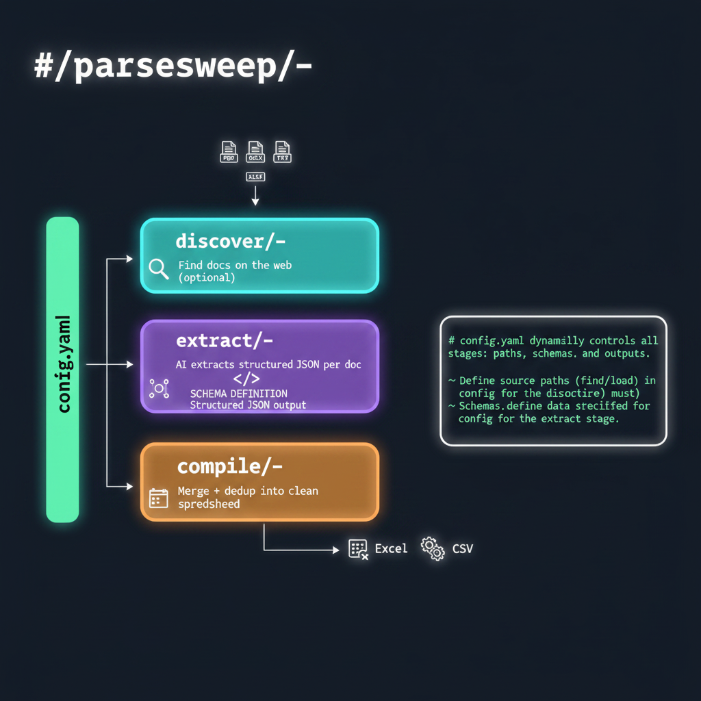

# ParseSweep

[](https://opensource.org/licenses/MIT)
[](https://www.python.org/downloads/)
[](https://github.com/bpulluta/parsesweep/actions/workflows/ci.yml)
[](https://bpulluta.github.io/parsesweep/)

📖 **[Documentation](https://bpulluta.github.io/parsesweep/)** · [Getting Started](https://bpulluta.github.io/parsesweep/getting-started.html) · [Tuning & Iteration](https://bpulluta.github.io/parsesweep/tuning.html)

**AI-powered document extraction pipeline.**

ParseSweep discovers, extracts, and compiles structured data from documents into Excel/CSV. Define what you need with a JSON schema, configure how to run it with a YAML config, and let the AI handle the rest.



## What It Does

```
Documents (PDF, DOCX, TXT, XLSX)
        │
        ▼
┌─── discover ───┐    ┌─── extract ───┐    ┌─── compile ───┐
│ Find docs on   │ →  │ AI extracts   │ →  │ Merge + dedup │ → Excel/CSV
│ the web        │    │ structured    │    │ into clean    │
│ (optional)     │    │ JSON per doc  │    │ spreadsheet   │
└────────────────┘    └───────────────┘    └───────────────┘
```

Each step runs independently via the same config file.

---

## Quick Start

```bash
# Install and setup
curl -fsSL https://pixi.sh/install.sh | bash
git clone https://github.com/bpulluta/parsesweep.git && cd parsesweep
pixi install
pixi run psweep init   # configure API credentials

# Run extraction
pixi run psweep extract --config config/utility_rate_tariffs/run.yaml

# Compile results into Excel
pixi run psweep compile --config config/utility_rate_tariffs/run.yaml
```

---

## Architecture

### Two Files Per Domain

| File | Role |
|------|------|
| **Schema** (JSON) | Defines WHAT to extract — field names, types, descriptions |
| **Config** (YAML) | Defines HOW to run — paths, page targeting, dedup, output format |

### Config Is the Single Entry Point

```bash
# Every command takes --config
psweep discover --config config/my_domain/run.yaml
psweep extract  --config config/my_domain/run.yaml
psweep compile  --config config/my_domain/run.yaml
```

Each command reads its own section from the config:

```yaml
# config/my_domain/run.yaml
domain: my_domain

extraction:
  schema: schemas/personal/my_schema.json
  input_dir: documents/my_domain          # where documents live
  output_dir: extracted/my_domain
  pages:
    auto_locate:
      section_description: "the section with rate tables"
      trigger_chars: 200000

compilation:
  schema: schemas/personal/my_schema.json
  input_dir: extracted/my_domain          # default: matches extraction output_dir
  output_dir: compiled/my_domain
  # Dedup identity is schema-owned ($metadata.identity.deduplication.key_fields)
  output:
    default_format: excel

discovery:   # optional — only for web document acquisition
  targets_csv: targets.csv
  queries:
    - "{entity} {state} filetype:pdf"
```

### Modular by Design

Run any step independently or chain them:

```bash
# Full pipeline
psweep discover --config config/tariffs/run.yaml
psweep extract  --config config/tariffs/run.yaml
psweep compile  --config config/tariffs/run.yaml

# Or just extract from local documents
psweep extract --config config/tariffs/run.yaml

# Or just compile existing extractions
psweep compile --config config/tariffs/run.yaml
```

---

## Commands

| Command | Purpose |
|---------|---------|
| `run` | Run full pipeline (discover → extract → compile) from a config file |
| `extract` | Extract structured data from documents to JSON |
| `compile` | Merge extracted JSONs into Excel/CSV with deduplication |
| `discover` | Find and download documents from the web |
| `curate` | Filter discovered documents via review |
| `validate` | Run QA/QC validation (multi-model extract + report, or report-only) |
| `benchmark` | Performance profiling across runs |
| `check` | Validate an extraction result |
| `check-schema` | Validate a schema file |
| `init` | Interactive project setup |
| `init-domain-schema` | Create a starter schema for a new domain |
| `preview` | Preview document content |
| `estimate` | Estimate extraction cost/time |
| `config` | Show current configuration |

### Extract

```bash
pixi run psweep extract --config config/my_domain/run.yaml

# Options
  --config PATH       Config YAML (required for full features)
  --schema PATH       Schema-only mode (quick testing without a config file)
  -n N                Limit to N files
  --fresh             Re-extract existing files (ignore cached output)
  --live-dashboard    Real-time progress display
  --validate-config   Dry run — validate inputs only
```

### Compile

```bash
pixi run psweep compile --config config/my_domain/run.yaml

# Options
  --config PATH       Config YAML
  --schema PATH       Schema-only mode
  --dry-run           Preview deduplication without writing
  --validate-config   Dry run — validate inputs only
```

### Curate

```bash
pixi run psweep curate --config config/my_domain/run.yaml
pixi run psweep curate --run discovered/my_domain/latest

# Options
  --config PATH       Config YAML or domain run config
  --run PATH          Specific run directory
  --quiet             Minimal output
  --verbose           Detailed output
```

### Discover

```bash
pixi run psweep discover --config config/my_domain/run.yaml

# Options
  --config PATH       Config YAML (required)
  --dry-run                     Show plan without downloading
  --max-concurrent-downloads N  Limit parallel downloads
```

### Discovery Configuration

Discovery uses a `targets.csv` where each row is a target to search for. All columns automatically flow into the document reviewer as context:

```csv
label,jurisdiction,state,topic,technology
"Chaffee County CO","Chaffee County",Colorado,geothermal ordinance,geothermal electricity
"Imperial County CA","Imperial County",California,geothermal ordinance,geothermal electricity
```

**Key discovery config sections:**

```yaml
discovery:
  targets_csv: targets.csv
  queries:
    # Templates — variables come from targets.csv columns
    - "{jurisdiction} {state} ordinance filetype:pdf"
    - "{jurisdiction} {state} zoning code division filetype:pdf"

  selection:
    max_per_target: 7             # candidates downloaded per target
    exclude: [press release, fact sheet, presentation]

  document_classifier:            # cheap keyword pre-filter (no API calls)
    required_keywords: [ordinance, code, chapter, section]
    min_required_matches: 2
    action: warn

  document_review:                # LLM curation (uses secondary model)
    model: secondary
    document_description: >-
      enacted county ordinance that regulates geothermal electricity
      generation. Must be codified regulation text, not a draft or EIR.
    keep_top: 1                   # curate the single best per target
    action: move

  partition_by: [state, jurisdiction]
```

The `document_description` defines what document type to select. The `target_context` (all columns from targets.csv) tells the reviewer which specific target each document should match. This separation means:
- Change what TYPE of document you want → edit `document_description`
- Change what TARGET to search for → edit `targets.csv`
- No code changes needed for either

---

## Setting Up a New Domain

### 1. Create Schema

Define what to extract:

```bash
pixi run psweep init-domain-schema --name my_domain \
  --reference-schema schemas/example_utility_rate_schema.json
```

Or create manually — a minimal schema:

```json
{
  "$schema": "http://json-schema.org/draft-07/schema#",
  "$metadata": {
    "extraction": {
      "main_data_array": "items",
      "identifier_fields": ["metadata.name"],
      "context_objects": ["metadata"]
    }
  },
  "type": "object",
  "properties": {
    "metadata": {
      "type": "object",
      "properties": {
        "name": { "type": "string", "description": "Document name" }
      }
    },
    "items": {
      "type": "array",
      "items": {
        "type": "object",
        "properties": {
          "field1": { "type": "string", "description": "First field" },
          "field2": { "type": ["number", "null"], "description": "Second field" }
        }
      }
    }
  }
}
```

Save it to `schemas/personal/my_schema.json`. The `schemas/personal/` directory is the recommended location for your project-specific schemas.

### 2. Create Config

Copy the template and customize:

```bash
cp config/TEMPLATE.yaml config/my_domain/run.yaml
```

Minimal config for testing:

```yaml
domain: my_domain

extraction:
  schema: schemas/personal/my_schema.json
  input_dir: documents/my_domain
  output_dir: extracted/my_domain

compilation:
  schema: schemas/personal/my_schema.json
  input_dir: extracted/my_domain
  output_dir: compiled/my_domain
  # Dedup identity is schema-owned ($metadata.identity.deduplication.key_fields)
```

### 3. Extract and Compile

```bash
# Put test documents in documents/my_domain/

# Schema-only quick test (no config needed, good for iteration)
pixi run psweep extract documents/my_domain/ \
  --schema schemas/personal/my_schema.json -n 2

# Full run via config (recommended — picks up all settings)
pixi run psweep extract --config config/my_domain/run.yaml
pixi run psweep compile --config config/my_domain/run.yaml
```

---

## Large Documents

For documents over 200 pages, configure **page targeting** to automatically find relevant sections:

```yaml
extraction:
  schema: schemas/personal/my_schema.json
  pages:
    csv: config/domain/page_ranges.csv   # manual ranges (win over auto)
    auto_locate:                          # LLM fallback for uncovered docs
      section_description: "the section containing rate schedules"
      trigger_chars: 200000              # only for docs exceeding this size
      max_selected_pages: 30
```

- Use `pages.csv` alone for fully manual ranges
- Use `pages.auto_locate` alone for fully automatic targeting
- Use both: CSV entries win, auto-locate fills in uncovered large docs
- `--pages 615-759` — CLI override for a single file
- `max_context: 1400000` — brute force (expensive)

---

## QA/QC Multi-Model Validation

Run 2+ models on the same documents using the centralized run config:

```bash
pixi run psweep validate --config config/my_domain/run.yaml

# Rebuild reports later without re-running extraction
pixi run psweep validate --config config/my_domain/run.yaml --compare-only
```

Configure in the `validation:` section of your config:

```yaml
validation:
  models: [primary, secondary]
  report:
    include_missing_in_queue: true
    include_low_signal_presence_in_queue: false
  comparison_approach: mixed
  record_matching:
    key_fields: [field1, field2]
  comparison:
    primary_fields: [value, unit]
  judge:
    enabled: true
    model: judge
```

---

## Multi-Source Synthesis

When extracting from many documents about the same entities (news articles, filings, reports for the same set of companies or sites), the **synthesis** stage reconciles multiple per-document records into one authoritative row per entity — resolving conflicts, tracking confidence, and collecting citation URLs.

Configure in the `compilation.synthesis:` block:

```yaml
compilation:
  schema: schemas/personal/my_schema.json
  input_dir: extracted/my_domain
  output_dir: compiled/my_domain
  synthesis:
    enabled: true
    min_sources_for_llm: 2          # skip LLM call when only 1 source
    group_by: ["entity.name"]       # one output row per distinct entity
    identity_fields:
      - entity.category
      - entity.location
    citation_field: source_provenance.citation_url
    reconcile_fields:
      - {field: status}
      - {field: date_announced, evidence: evidence_announced}
      - {field: value, evidence: value_evidence}
```

Synthesis runs automatically on `compile` when enabled. It uses the same LLM configured in your environment (override with `synthesis.model:` for a specific stage).

### Keeping repeated sub-entities apart

By default every item found in the extracted array is folded into one row per entity. When a record repeats sub-entities (phases, expansions, line items, permit conditions...), add `item_group_by` — item-level field paths — to synthesize one row per sub-entity instead:

```yaml
  synthesis:
    enabled: true
    group_by: ["entity.name"]       # one output row per distinct entity ...
    item_group_by: ["phase_label"]  # ... per distinct sub-entity within it
```

Items are bucketed by that key across *all* sources for the entity, so the same phase reported by three documents is still reconciled once. Items missing the key are kept in their own row rather than dropped, and the item-group fields appear as columns alongside `group_by` and `identity_fields`. Leaf names must not collide with `group_by` leaf names — that is rejected at config load.

---

## Project Structure

```
parsesweep/
├── config/                    # Domain configs (one per domain)
│   ├── TEMPLATE.yaml          # Annotated template — copy this to start
│   ├── utility_rate_tariffs/
│   │   ├── run.yaml
│   │   └── page_ranges.csv    # optional manual page ranges
│   └── datacenter_timelines/
│       └── run.yaml
├── schemas/
│   ├── personal/              # Your extraction schemas (JSON) — put new schemas here
│   └── example_utility_rate_schema.json
├── documents/                 # Input documents (created by you)
├── extracted/                 # JSON extraction output (generated)
├── compiled/                  # Final Excel/CSV output (generated)
├── discovered/                # Web discovery output (generated by discover)
└── src/psweep/                # Source code
    ├── cli/                   # CLI commands
    ├── discovery/             # Web document discovery
    ├── extraction/            # Document extraction
    ├── compilation/           # Data compilation + synthesis
    ├── validation/            # QA/QC multi-model comparison
    └── utils/                 # Shared utilities
```

---

## Configuration Reference

See `config/TEMPLATE.yaml` for a fully annotated config template.

### Config Sections

| Section | Used By | Required |
|---------|---------|----------|
| `extraction:` | `extract` | Yes (needs `schema`) |
| `compilation:` | `compile` | Yes (needs `schema`) |
| `discovery:` | `discover` | Only for web discovery |
| `validation:` | `validate` | QA/QC validation stage |
| `domain:` | All | Recommended |
| `models:` | All | Optional (env default) |

### Key Extraction Settings

```yaml
extraction:
  schema: path/to/schema.json      # required
  input_dir: path/to/documents     # required (or pass as CLI argument)
  output_dir: extracted/domain     # default: extracted/<domain>
  max_context: 600000              # chars per document
  pages:                           # page selection for large PDFs
    csv: path/to/ranges.csv        # manual ranges (win over auto)
    auto_locate:                   # LLM fallback for uncovered docs
      section_description: "..."
      trigger_chars: 200000
      max_selected_pages: 30
```

### Key Compilation Settings

```yaml
compilation:
  schema: path/to/schema.json      # required
  input_dir: extracted/domain      # required (or pass as CLI argument)
  output_dir: compiled/domain      # default: compiled/<domain>
  # Dedup identity is schema-owned — set $metadata.identity.deduplication
  # .key_fields in the schema, not here (used by extract/compile/api alike).
  normalization:
    state_column: State            # auto-abbreviate state names
  output:
    default_format: excel          # excel, csv, or both
    column_order: [f1, f2, ...]    # custom column ordering
    column_renames: {Old: new}     # rename columns
    exclude_fields: [internal_f]   # hide columns
    freeze_columns: 2              # freeze in Excel
    auto_width: true               # auto-size columns
  synthesis:                       # optional — multi-source reconciliation
    enabled: true
    group_by: ["entity.key_field"]
    reconcile_fields:
      - {field: some_field}
```

### Model Overrides (Optional)

```yaml
# ── Model tiers ──────────────────────────────────────────────────────────────
# Define model identifiers ONCE. Each pipeline stage references a tier name
# (primary/secondary) — never a raw model string — so you can swap models
# globally by editing only these two lines.
#
#   primary   → used for extraction (accuracy-critical)
#   secondary → used for discovery review, page targeting (speed/cost-critical)
#
# For iteration/testing: set both to mini. For production: use full-size primary.
models:
  primary: gpt-4.1                 # swap to gpt-4.1-mini for fast iteration
  secondary: gpt-4.1-mini          # cheap/fast for non-extraction stages

# Stages reference tier names:
extraction:
  model: primary                   # ← resolves to gpt-4.1

discovery:
  document_review:
    model: secondary               # ← resolves to gpt-4.1-mini
```

When using an endpoint override (`LLM_BASE_URL`), use whatever model names the proxy advertises:

```yaml
# Proxy model names — exactly as shown in the proxy's model hub
models:
  primary: gpt-5.5
  secondary: gpt-5-mini
  # The proxy handles routing to the actual provider — no provider config needed
```

**Workflow:**
- Testing/iterating: set both tiers to `mini` (fast + cheap)
- Production: change only `primary` to the full model (one edit)
- Stage-level granularity available if needed
- To switch between proxy and direct provider: change `.env`, not the YAML

---

## Cost Visibility & Accounting

ParseSweep tracks costs at every stage and surfaces them to the user.

### Before a Run

```bash
# Validate config without any API calls
pixi run psweep extract --config config/my_domain/run.yaml --validate-config

# Estimate cost before committing
pixi run psweep estimate discovered/my_domain/latest/curated

# Discovery dry-run (no downloads or LLM calls)
pixi run psweep discover --config config/my_domain/run.yaml --dry-run
```

### During a Run

Extraction shows per-file cost in real-time:
```
✓ 42 items $0.0121 • 75.3s
```

### After a Run

**Extraction summary** with total/average cost:
```
╭─── Extraction Summary ───╮
│ Total Cost    $0.0389     │
│ Avg Cost/File $0.0195     │
│ Total Items   99          │
╰───────────────────────────╯
```

**Pipeline accounting** — written on compile to `compiled/{domain}/run_accounting.json`:
```json
{
  "stages": {
    "discovery": { "seeker_queries": 2, "review_cost_usd": 0.011, ... },
    "extraction": { "model": "gpt-4.1-mini", "cost_usd": 0.021, "input_tokens": 42498, ... },
    "compilation": { "records": 67, "duplicates_removed": 1 }
  },
  "totals": { "cost_usd": 0.032, "elapsed_seconds": 275.9, "llm_calls": 15, "tokens": 77230 }
}
```

### Caching & Re-runs

Every stage honors previous work by default and exposes one consistent
`--fresh` flag to ignore it and start over:

```bash
# Default: skip targets/files completed in a previous run
pixi run psweep discover --config config/my_domain/run.yaml
pixi run psweep extract  --config config/my_domain/run.yaml

# Re-run discovery from scratch (ignore the checkpoint + refresh search cache)
pixi run psweep discover --config config/my_domain/run.yaml --fresh

# Force re-extract (no need to delete files)
pixi run psweep extract --config config/my_domain/run.yaml --fresh

# Whole pipeline fresh — propagates --fresh to discover and extract
pixi run psweep run --config config/my_domain/run.yaml --fresh
```

`compile` always rewrites its output, so it needs no flag.

**What `--fresh` clears, per stage:**

| Stage | `--fresh` action |
| --- | --- |
| `discover` | Deletes the crash-resume checkpoint (`discovered/<domain>/checkpoint.json`) so every target re-runs, and refreshes the SerpApi result cache (`discovered/<domain>/.serpapi_cache/`) with fresh live queries. |
| `extract` | Re-extracts every document even if a JSON output already exists. |
| `compile` | No flag — output is always rewritten. |

**Automatic content-keyed caches (no flag, safe to ignore):** extraction also
keeps an OCR text cache (`documents/<domain>/.text/`) and a page-targeting
cache (`documents/<domain>/.pages/`). Both are keyed on file content/mtime, so
they self-invalidate when a source document changes and almost never need
manual clearing. To force a cold OCR/page re-run, delete those folders.

---

## Supported Formats

PDF, DOCX, DOC, TXT, XLSX, CSV

---

## Environment Setup

ParseSweep reads credentials from a `.env` file in the project root (or from environment variables). Configure exactly one provider block. Priority is highest → lowest.

### Option 1 — Generic endpoint override (recommended for shared/enterprise deployments)

Works with any OpenAI-compatible proxy: LiteLLM, OpenRouter, Azure AI Foundry, Together AI, vLLM, Ollama, etc. Model names in `run.yaml` must match exactly what the proxy advertises. To switch proxies, change two values — no code or schema changes needed.

```bash
LLM_BASE_URL=https://your-proxy.example.com/v1
LLM_API_KEY=sk-your-proxy-key
LLM_MODEL=gpt-4.1-mini     # optional default; overridden by run.yaml models:
```

```yaml
# run.yaml — use whatever model names your proxy advertises
models:
  primary: gpt-5.5
  secondary: gpt-5-mini
  # or mix providers served by the same proxy:
  # fast: claude-sonnet-4-5
  # smart: gpt-5.5
```

### Option 2 — Direct provider keys

```bash
# Azure OpenAI
AZURE_OPENAI_API_KEY=your-key
AZURE_OPENAI_ENDPOINT=https://your-resource.openai.azure.com/
AZURE_OPENAI_API_VERSION=2025-04-01-preview
AZURE_OPENAI_MODEL=your-deployment-name   # optional default

# OpenAI
OPENAI_API_KEY=sk-your-key

# Anthropic
ANTHROPIC_API_KEY=sk-ant-your-key

# Google Gemini
GEMINI_API_KEY=your-google-key
```

Copy `.env.example` to `.env` and uncomment one block. Run `psweep init` for interactive setup.

---

## Troubleshooting

**"No documents found"** — Check file extensions are supported and path exists.

**"Schema missing $metadata"** — Schema needs `$metadata.extraction.main_data_array` and `identifier_fields`.

**Large document timeout** — Add `pages.auto_locate` in your config or increase `max_context`.

**Rate limit errors** — API throttling (429). Wait and retry, or reduce batch size with `-n`. For proxy deployments, exponential backoff is built in.

**"No LLM provider configured"** — Check `.env` has one of: `LLM_BASE_URL`+`LLM_API_KEY`, `AZURE_OPENAI_API_KEY`, `ANTHROPIC_API_KEY`, `GEMINI_API_KEY`, or `OPENAI_API_KEY`.

**Wrong model name for proxy** — Model names must match exactly what your proxy's model hub shows. Run `psweep config` to confirm the resolved model.

---

## Development

```bash
pixi run python -m pytest tests/   # run tests
pixi run psweep check-schema schemas/personal/my_schema.json  # validate schema
pixi run psweep extract --config ... --validate-config  # dry-run validation
```

---

## License

MIT License. See [LICENSE](LICENSE).
