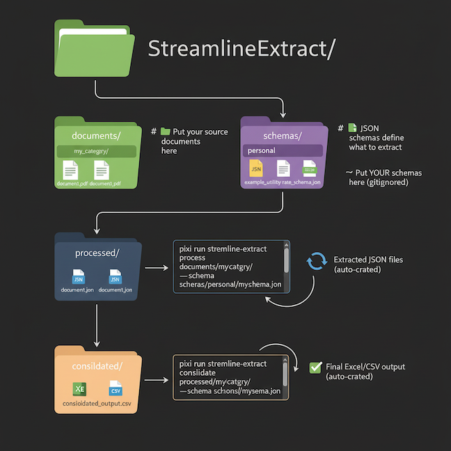

# StreamlineExtract

[](https://opensource.org/licenses/MIT)
[](https://www.python.org/downloads/)
[](https://github.com/bpulluta/StreamlineExtract/releases)

**Transform unstructured documents into structured data in minutes, not hours.**

StreamlineExtract uses AI to extract structured data from documents and consolidate it into Excel/CSV. No manual data entry, no complex parsing—just define what you need with a JSON schema and let the AI do the work.

### ✨ Key Features

- **Universal Document Support**: PDFs, Word docs, text files, spreadsheets—all in one pipeline
- **Schema-Driven Extraction**: Define your data structure once, extract consistently
- **AI-Powered Intelligence**: Understands context, handles variations, extracts semantically
- **Auto-Consolidation**: Merges extracted data with smart deduplication
- **Production-Ready**: Battle-tested on 100s of documents across multiple domains

### 💡 Perfect For

Transforming any unstructured documents into structured data:
- **Comparative analysis** - Extract consistent data from hundreds of similar documents
- **Batch processing** - Handle large document collections at scale
- **Data extraction** - Pull specific information from varying formats and structures  
- **Research & compliance** - Systematically capture data for analysis
- **Legacy digitization** - Convert paper-based archives into databases

Works with any document type: regulations, contracts, research papers, permits, invoices, tariffs, reports, filings, and more. Just define your data structure, and let AI handle the extraction.

**Version**: 2.0.1  
**Requirements**: Python 3.12+, pixi package manager  
**Supported Formats**: PDF, DOCX, DOC, TXT, XLSX, CSV

---

## Table of Contents

- [Quick Start](#quick-start)
- [Architecture](#architecture)
- [Documentation Map](#documentation-map)
- [New Domain Onboarding](#new-domain-onboarding)
- [Installation](#installation)
- [Configuration](#configuration)
- [Usage](#usage)
  - [Complete Workflow Example](#complete-workflow-example)
  - [Process Command](#process-command)
  - [Consolidate Command](#consolidate-command)
  - [Acquire Command](#acquire-command)
  - [Curate Command](#curate-command)
  - [Helper Commands](#helper-commands)
  - [QA/QC Multi-Model Validation](#qaqc-multi-model-validation)
- [Schemas](#schemas)
- [Examples](#examples)
- [Troubleshooting](#troubleshooting)
- [FAQ](#faq)
- [Contributing](#contributing)
- [License](#license)

---

## Quick Start

```bash
# 1. Install pixi package manager (manages all dependencies)
curl -fsSL https://pixi.sh/install.sh | bash

# 2. Clone and setup
git clone https://github.com/bpulluta/StreamlineExtract.git
cd StreamlineExtract
pixi install  # Installs Python 3.12 and all dependencies automatically

# 3. Configure API credentials (interactive wizard)
pixi run streamline-extract init
# → Walks you through Azure OpenAI or OpenAI setup
# → Creates .env file with your credentials

# 4. Extract data from documents to JSON
pixi run streamline-extract process documents/examples/ \
  --schema schemas/example_utility_rate_schema.json
# → Extracts structured data using the example schema
# → Outputs to processed/examples/*.json

# 5. Consolidate JSON files to Excel/CSV
pixi run streamline-extract consolidate processed/examples/ \
  --schema schemas/example_utility_rate_schema.json
# → Merges all JSON files with smart deduplication
# → Outputs to consolidated/examples/output.xlsx and .csv
```

**That's it!** You now have structured data ready for analysis.

---

## Architecture

StreamlineExtract operates on one contract-first runtime.

Core design rules:
- One active runtime path for `process`, `compare`, and `consolidate`
- One schema contract with required `$metadata` for extraction and consolidation behavior
- One optional runtime-pack layer for reusable domain behavior such as QA/QC lanes and presentation defaults
- One optional profile layer for environment-specific runtime settings
- One lineage model so outputs and reports can be traced back to the runtime artifact used to produce them

Use this ownership split when deciding where changes belong:

| Surface | Owns |
|---------|------|
| Schema | extraction row shape, field descriptions, identifiers, deduplication keys |
| Pack | reusable domain runtime behavior, QA/QC defaults, consolidation presentation |
| Profile | environment/runtime tuning |

The normal progression is:
1. Start with a lean schema.
2. Validate it on 1-2 representative documents.
3. Add a pack only when multiple runs need shared runtime behavior.
4. Add profile overrides only when environments actually differ.

This keeps onboarding simple for a new domain while preserving a clean path to larger, more configurable deployments.

---

## Documentation Map

Use the active docs for current operating guidance:

- `README.md`: product overview, architecture baseline, core workflows, onboarding entry points
- `schemas/SCHEMA_BEST_PRACTICES.md`: schema authoring, deduplication, and schema-versus-pack guidance
- `config/README.md`: runtime config layout and page-range conventions
- `.github/copilot-instructions.md`: repository-specific Copilot operating instructions and standard commands
- `CONTRIBUTING_ACQUISITION.md`: extending seeker/digger connectors, testing patterns, and configuration

If a document describes migration, phased implementation planning, release-gate bookkeeping, or retired implementation work, it should stay out of the tracked repo surface. Keep that material in a local ignored archive or in the issue tracker instead.

---

## New Domain Onboarding

When you are starting from raw source documents only, use the current runtime in this order:

1. Inspect 1-3 representative documents under `documents/<domain>/`.
2. Create a lean first-pass schema under `schemas/personal/`.
```bash
pixi run streamline-extract init-domain-schema \
  --name your_domain \
  --reference-schema schemas/personal/geothermal_ordinance_schema.json
```
If you already know the first few fields you want, trim the starter immediately:
```bash
pixi run streamline-extract init-domain-schema \
  --name your_domain \
  --reference-schema schemas/personal/geothermal_ordinance_schema.json \
  --include-field feature \
  --include-field value \
  --include-field units
```
3. Keep that first pass small:
   - include only the required `$metadata.extraction` fields, the required top-level objects, and a compact `requirements` row shape
   - model only the 4-8 highest-value fields you actually need for the first smoke extraction
   - delay rich examples, long enum lists, and output presentation tuning until after the first extraction works
4. Use the closest existing schema and `schemas/SCHEMA_BEST_PRACTICES.md` as reference material, not as something to copy wholesale.
  - `init-domain-schema` strips schema clutter so the starter focuses on extraction contract and row shape.
  - `--include-field` lets you keep only the first-pass fields you actually want to extract.
  - keep schema responsibility to extraction contract + minimal dedup semantics
  - keep pack responsibility to runtime modules, QA/QC behavior, and environment-specific runtime config
5. Validate the schema:
```bash
pixi run streamline-extract validate-schema schemas/personal/your_domain_schema.json
```
6. Scaffold the runtime pack, config, and workspace folders:
```bash
pixi run streamline-extract init-domain-pack \
  --name your_domain \
  --schema schemas/personal/your_domain_schema.json \
  --with-workspace \
  --with-config
```
   - by default this scaffold now emits the minimal core workflow only
   - use `--template-mode recommended` only when you explicitly want the extra QA/QC-oriented guidance
7. Validate the runtime seam:
```bash
pixi run streamline-extract validate-runtime \
  --pack schemas/domain_packs/your_domain/pack.yaml \
  --profile default
```
8. Process 1-2 documents first, then consolidate and inspect the output.
9. Iterate on the schema, page ranges, and QA/QC review until the extraction quality is acceptable.

What a lean first-pass schema should feel like:
- `jurisdiction`
- `document_applicability`
- `requirements[]` with only the core fields you need to compare across documents

Do not try to encode every edge case in the first version. Production schemas become detailed through iteration, not at the starting line.

Starter references that work well today:
- solar: `schemas/personal/solar_ordinance_schema.json`
- geothermal: `schemas/personal/geothermal_ordinance_schema.json`
- air quality: `schemas/personal/air_quality_permits_schema.json`
- tariffs: `schemas/personal/electricity_tariff_schema.json`

Solar example:
```bash
pixi run streamline-extract init-domain-schema \
  --name solar \
  --reference-schema schemas/personal/solar_ordinance_schema.json

pixi run streamline-extract process documents/solar/ \
  --schema schemas/personal/solar_ordinance_schema.json \
  --profile default \
  --pages-csv config/solar/page_ranges.csv

pixi run streamline-extract consolidate processed/solar \
  --schema schemas/personal/solar_ordinance_schema.json
```

If you want Copilot to drive this workflow, use the workspace prompt `/greenfield-domain` and point it at the document folder you want to bootstrap.

---

## Project Structure

StreamlineExtract organizes your work into a simple folder structure:



**Workflow:**
1. Put documents in `documents/topic/`
2. Create schema in `schemas/personal/your_schema.json`
3. Run `process` → Creates `processed/topic/*.json`
4. Run `consolidate` → Creates `consolidated/topic/*.xlsx|csv`

**Pro Tips:**
- **Use `schemas/personal/`** for your custom schemas (this folder is gitignored to prevent accidentally committing schemas)
- The same category name flows through: `documents/X/` → `processed/X/` → `consolidated/X/`
- `processed/` and `consolidated/` folders are created automatically

---

## Installation

### Prerequisites

> **📦 What is pixi?** A modern package manager that handles Python, dependencies, and environments automatically. No more `pip install` or virtualenv management—pixi does it all.

**Required:**
- **pixi package manager**: Manages all dependencies automatically
- **API Access**: Azure OpenAI or OpenAI account
- **System**: macOS, Linux, or Windows with WSL
- **Disk Space**: ~500MB for full installation
- **RAM**: 4GB minimum, 8GB recommended for large documents

### Install Steps

#### Option 1: Using pixi (Recommended)

```bash
# 1. Install pixi (takes ~30 seconds)
curl -fsSL https://pixi.sh/install.sh | bash

# 2. Clone repository
git clone https://github.com/bpulluta/StreamlineExtract.git
cd StreamlineExtract

# 3. Install dependencies (takes ~2-3 minutes, installs Python 3.12 + all packages)
pixi install
```

✅ **Verify installation:**
```bash
pixi run streamline-extract --version
# Should output: streamline-extract, version 2.0.1
```

---

## Configuration

### Option 1: Interactive Setup (Recommended)

```bash
pixi run streamline-extract init
```

The wizard will guide you through:
- ✓ API provider selection (Azure OpenAI or OpenAI)
- ✓ Credential entry and validation
- ✓ Model selection
- ✓ Default settings configuration
- ✓ Project structure setup

**After setup, test your configuration:**
```bash
pixi run streamline-extract config
# Displays your current settings (credentials are hidden)

# Optional: Test with a single document
pixi run streamline-extract preview documents/examples/sample_utility_rate.txt
```

### Option 2: Manual Setup

Create a `.env` file in the project root directory:

```bash
# For Azure OpenAI (recommended for enterprise)
AZURE_OPENAI_API_KEY=your-api-key-here
AZURE_OPENAI_ENDPOINT=https://your-resource.openai.azure.com/
AZURE_OPENAI_MODEL=gpt-4o-mini  # or your deployment name

# OR for OpenAI
OPENAI_API_KEY=sk-your-api-key-here
```

**Verify manual configuration:**
```bash
pixi run streamline-extract config
# Should show your API provider and model (no errors)
```

---

## Usage

### Complete Workflow Example

Here's a typical end-to-end workflow:

```bash
# 1. Estimate costs before processing (optional but recommended)
pixi run streamline-extract estimate documents/examples/
# → Shows estimated documents count, cost, and processing time

# 2. Extract data from documents
pixi run streamline-extract process documents/examples/ \
  --schema schemas/example_utility_rate_schema.json \
  --live-dashboard
# → Processes each document with real-time progress
# → Outputs: processed/examples/doc1.json, doc2.json, ...

# 3. Review extracted data (optional)
cat processed/examples/sample_doc.json | head -50

# 4. Consolidate all JSON files
pixi run streamline-extract consolidate processed/examples/ \
  --schema schemas/example_utility_rate_schema.json
# → Merges all JSONs with smart deduplication
# → Outputs: 
#   - consolidated/examples/examples_consolidated.xlsx
#   - consolidated/examples/examples_consolidated.csv

# 5. Open and analyze
open consolidated/examples/examples_consolidated.xlsx
```

### Process Command

Process documents and extract structured data to JSON files.

**What it does:** Reads documents, sends content to AI with your schema, saves structured JSON responses.

#### Basic Usage

```bash
pixi run streamline-extract process <input_directory>
```

#### Options

| Option | Description | Default |
|--------|-------------|---------|
| `--schema PATH` | Custom schema file | REQUIRED |
| `--output PATH` | Output directory | `processed/<input_name>/` |
| `--pages RANGE` | Page range for single PDF (e.g., "615-759") | All pages |
| `--pages-csv PATH` | CSV with per-file page ranges | None |
| `--max-context N` | Max characters per document | 400000 |
| `--limit N` | Process only N files | All files |
| `--enable-qa-qc` | Enable quality checks | Disabled |
| `--reprocess` | Re-extract existing files | Skip existing |
| `--live-dashboard` | Show real-time progress | Disabled |
| `--verbose`, `-v` | Detailed output | Normal |
| `--quiet`, `-q` | Minimal output | Normal |
| `--debug` | Full debug logs | Disabled |

#### Examples

```bash
# Basic extraction
pixi run streamline-extract process documents/contracts/

# With custom schema
pixi run streamline-extract process documents/tariffs/ \
  --schema schemas/electricity_tariff_schema.json

# Extract only specific pages from a large PDF (NEW in 2.0.1!)
pixi run streamline-extract process documents/tariff_book.pdf \
  --pages 615-759 \
  --schema schemas/my_schema.json

# Batch processing with different page ranges per file
pixi run streamline-extract process documents/tariffs/ \
  --pages-csv page_ranges.csv \
  --schema schemas/my_schema.json

# Large documents with live dashboard
pixi run streamline-extract process documents/reports/ \
  --max-context 1400000 \
  --live-dashboard

# Test run (limit to 3 files)
pixi run streamline-extract process documents/examples/ \
  --schema schemas/example_utility_rate_schema.json \
  --limit 3
```

**CSV format for `--pages-csv`:**
```csv
file_path,start_page,end_page
tariff1.pdf,615,759
tariff2.pdf,400,550
small_doc.pdf,,
```
Empty start/end means extract full document.

---

### ⚡ Processing Large Documents - Page Range Optimization

**Problem**: When extracting from large documents (200+ pages), important details at the end of sections (like ADJUSTMENTS, footnotes, or appendices) may be lost due to context window limitations.

**Solution**: Break large documents into focused page ranges for optimal extraction quality.

#### 📊 Recommended Settings

> **Sweet Spot: 50-100 pages per extraction**
> - ✅ Captures complete sections including end-matter
> - ✅ Maintains 100% data capture rate
> - ✅ Cost-effective: $0.04-0.06 per extraction
> - ✅ Processing time: 3-5 minutes
>
> **Max Context: `--max-context 600000`**
> - ✅ Optimal for 50-100 page ranges
> - ❌ No benefit to increasing beyond 600k

#### Example: Breaking a Large Tariff (340 pages)

**⚠️ Current Limitation**: CSV only supports **one page range per file**. If the same file appears multiple times with different ranges, only the last entry is kept.

**For multiple sections from one file**, process separately then combine:

```bash
# Step 1: Extract each section to separate directories
# Residential rates (pages 30-130)
pixi run streamline-extract process documents/tariffs/tariff_book.pdf \
  --schema schemas/example_utility_rate_schema.json \
  --pages 30-130 \
  --output processed/tariffs/residential/ \
  --max-context 600000

# Commercial rates (pages 131-230)
pixi run streamline-extract process documents/tariffs/tariff_book.pdf \
  --schema schemas/example_utility_rate_schema.json \
  --pages 131-230 \
  --output processed/tariffs/commercial/ \
  --max-context 600000

# Industrial rates (pages 231-330)
pixi run streamline-extract process documents/tariffs/tariff_book.pdf \
  --schema schemas/example_utility_rate_schema.json \
  --pages 231-330 \
  --output processed/tariffs/industrial/ \
  --max-context 600000

# Step 2: Combine all JSON files into one directory with unique names
mkdir -p processed/tariffs_all
cp processed/tariffs/residential/*.json processed/tariffs_all/tariff_residential.json
cp processed/tariffs/commercial/*.json processed/tariffs_all/tariff_commercial.json
cp processed/tariffs/industrial/*.json processed/tariffs_all/tariff_industrial.json

# Step 3: Consolidate
pixi run streamline-extract consolidate processed/tariffs_all/ \
  --schema schemas/example_utility_rate_schema.json
```

**Why separate directories?** Extracting the same source file multiple times creates JSONs with identical names - they'd overwrite each other in the same directory.

**CSV is best for**: Processing **different files**, each with their own page range:

**config/tariffs/page_ranges.csv:**
```csv
file_path,start_page,end_page
utility1_tariff.pdf,615,650
utility2_tariff.pdf,100,200
utility3_tariff.pdf,50,150
```

```bash
pixi run streamline-extract process documents/tariffs/ \
  --schema schemas/example_utility_rate_schema.json \
  --pages-csv config/tariffs/page_ranges.csv
```

#### 🎯 Automatic page targeting (optional, LLM-assisted)

When you *don't* have hand-derived page numbers, `process` can find the right
pages itself. Add a `page_targeting` block to the `processing` config: for any
large PDF **without** a manual range, it runs a cheap keyword scan to shortlist
candidate pages, then one LLM call to confirm the exact range, and extracts only
those pages. Manual `page_ranges.csv` / `--pages` always take precedence.

```yaml
processing:
  input_dir: output/acquisition/utility_rate_tariffs/latest/curated
  schema: schemas/domain_packs/tariffs/pack.yaml
  pages_csv: config/utility_rate_tariffs/page_ranges.csv   # optional; wins where present
  page_targeting:
    enabled: true
    section_description: >-
      the residential electric rate schedules showing per-kWh energy charges,
      monthly customer charge, and other rate components
    trigger_chars: 200000       # only run when the document exceeds this size
    max_selected_pages: 30
    # keywords: [rate schedule, residential, per kwh]   # optional heuristic boosts
    # model: gpt-4o-mini                                 # optional cheaper locator model
```

The discovered range is cached in a `.pages/<name>.json` sidecar next to the
file (keyed on the file and the section description), so the locator LLM call
happens once and is reused on re-runs. On any failure it falls back to
full-document extraction.

---

### Acquire Command

Discover, download, and curate source documents from the web before extraction.

**What it does:** Queries web search (via SerpApi) or crawls seed URLs to find candidate documents for each target, downloads the accepted files, then **grades every download with an LLM** against a plain-language description of the document you actually want and promotes the best one(s) per target into a `curated/` set. Everything for a run lives in **one self-contained folder** under `output/acquisition/<domain>/runs/<run_id>/`, with a `latest` pointer so downstream steps never need to know the run id.

Key properties:
- **Recall-first + LLM curation:** acquisition favors finding the governing document; the LLM reviewer handles precision, so presentations, drafts, notices, and tangential reports stay out of `curated/`.
- **OCR once, reuse everywhere:** scanned/image PDFs are OCR'd a single time and the text is cached next to the file (`.text/`); the extraction stage reuses it instead of re-OCRing. Native-text PDFs are always read fresh (no flattened cache) so table structure is preserved.
- **Human-in-the-loop:** every download is written to an editable `review.csv`; correct any wrong calls and run [`curate`](#curate-command) to rebuild `curated/`.

The `acquire` command is an optional pre-processing stage. After it runs, point `process` at `output/acquisition/<domain>/latest/curated` and continue normally.

#### Basic Usage

```bash
# Dry-run: discover candidates without downloading
pixi run streamline-extract acquire \
  --domain generator_manuals \
  --seed-url "https://generac.com/products/industrial" \
  --dry-run

# Live run: discover and download
pixi run streamline-extract acquire \
  --domain generator_manuals \
  --seed-url "https://generac.com/products/industrial" \
  --query "Generac 250kW industrial generator manual pdf"

# From a config file (recommended for repeatable runs)
pixi run streamline-extract acquire --config config/generator_manuals/run.yaml
```

#### Options

| Option | Description | Default |
|--------|-------------|----------|
| `--domain NAME` | Domain key for output organization | Required |
| `--config PATH` | Runtime config YAML file | None |
| `--seed-url URL` | Starting URL (repeatable) | None |
| `--query TEXT` | Search query or intent keywords | None |
| `--enable-serpapi` | Use SerpApi for web search discovery | Disabled |
| `--topology` | Routing mode: `distributed`, `centralized`, `hybrid` | Default |
| `--output-documents PATH` | Override documents output directory | `output/acquisition/<domain>/runs/<id>/documents/` |
| `--output-manifest PATH` | Override manifest path | `output/acquisition/<domain>/runs/<id>/manifest.json` |
| `--dry-run` | Discover candidates but skip downloads | Off |
| `--partition-mode MODE` | `jurisdiction`, `host`, or `auto` | `auto` |
| `--state TEXT` | State hint for jurisdiction partitioning | None |
| `--jurisdiction TEXT` | Jurisdiction hint for partitioning | None |
| `--max-depth N` | Maximum crawl depth | 2 |
| `--max-pages N` | Maximum pages to crawl per seed | 50 |
| `--max-files N` | Maximum files to download | 20 |
| `--timeout-seconds N` | Crawl timeout | 30 |
| `--robots-policy-mode MODE` | `ignore`, `warn`, or `enforce` | `ignore` |
| `--tos-policy-mode MODE` | `ignore`, `warn`, or `enforce` | `ignore` |
| `--validate-config` | Validate config file and exit | Off |
| `--show-effective-config` | Print resolved inputs with source attribution | Off |
| `--dry-run` | Discover candidates without downloading | Off |
| `--verbose`, `-v` | Detailed output | Normal |
| `--quiet`, `-q` | Minimal output | Normal |

#### Requirements for SerpApi

Set one of the following environment variables before using `--enable-serpapi`:

```bash
export SERPAPI_API_KEY=your-key-here
# OR
export SERPAPI_KEY=your-key-here
```

Optional SSL override if your environment uses TLS interception:
```bash
export SERPAPI_SSL_VERIFY=false
```

#### Full Pipeline: Acquire → (Review) → Process → Consolidate

```bash
# 1. Discover, download, and LLM-curate documents
pixi run streamline-extract acquire --config config/generator_manuals/run.yaml

# 2. (Optional) Review the LLM's picks and correct any mistakes:
#    open the run's review.csv, set human_decision = keep/reject, then:
pixi run streamline-extract curate --config config/generator_manuals/run.yaml

# 3. Process the curated set (config input_dir points at latest/curated)
pixi run streamline-extract process --config config/generator_manuals/run.yaml

# 4. Consolidate to Excel
pixi run streamline-extract consolidate --config config/generator_manuals/run.yaml
```

Because the config's `processing.input_dir` points at
`output/acquisition/<domain>/latest/curated`, steps 3–4 always consume the
curated (LLM-reviewed + human-approved) set of the most recent run.

#### Config File Pattern

Place acquisition config in `config/<domain>/run.yaml`. This keeps repeatable run inputs separate from the extraction schema:

```yaml
domain: generator_manuals

acquisition:
  topology:
    mode: distributed
  targets:
    - manufacturer: Generac
      power_class_kw: "200-300"
      query: "Generac industrial generator manual pdf"
    - manufacturer: John Deere
      power_class_kw: "200-300"
      query: "John Deere generator operator manual pdf"
  query_families:
    generator_similar_power:
      - "{manufacturer} {power_class_kw} kW generator spec pdf"
      - "{manufacturer} generator {power_class_kw} kW manual pdf"
  seeker:
    provider: serpapi
    use_query_family: generator_similar_power
    max_results: 6
  link_prioritization:                     # ranking (own block, not under seeker)
    mode: heuristic                        # heuristic | off
    keywords: [manual, operator, installation]   # domain-specific boosts
    domain_scores:                         # soft authority boosts (not a filter)
      "generac.com": 0.2
      "cummins.com": 0.2
    # top_k: 5                             # optional global cap; omit for no cap
  document_review:                         # LLM curation of downloads (optional)
    document_description: >-               # plain-language target for the reviewer
      the manufacturer's official operator/installation manual for this
      generator — not a spec sheet, brochure, or parts list
    keep_top: 1                            # primaries to promote per target
  runtime:
    min_request_interval_ms: 200
    max_concurrent_downloads: 2
    robots_policy_mode: ignore
    tos_policy_mode: ignore

processing:
  # Consume only the curated set from the latest acquire run.
  input_dir: output/acquisition/generator_manuals/latest/curated
  schema: schemas/personal/generator_manuals_schema.json
  output_dir: processed/generator_manuals

consolidation:
  input_dir: processed/generator_manuals
  schema: schemas/personal/generator_manuals_schema.json
  output_dir: consolidated/generator_manuals
```

#### Acquisition Outputs

Each run is one self-contained, run-scoped folder, with a `latest` pointer to the most recent run that produced downloads:

```
output/acquisition/<domain>/
    checkpoint.json                 # domain-level resume state
    latest -> runs/<run_id>         # symlink to the current run
    runs/<run_id>/
        manifest.json               # full run record: timing, stage summaries, lineage
        download_index.csv          # machine-readable file list (+ review columns)
        review.csv                  # human-editable curation ledger (see Curate)
        documents/                  # ALL downloads (recall set)
            <partition>/<file>.pdf
            <partition>/.text/<file>.txt    # cached OCR text (scanned PDFs only)
            <partition>/.review/<file>.json # per-file LLM verdict + human override
        curated/                    # final selected docs only → downstream input
            <partition>/<file>.pdf
```

`<partition>` is `by_state_jurisdiction/<state>/<jurisdiction>/`, `by_host/<source-host>/`, or a custom `partition_by`, per config.

The manifest includes:
- `timing`: `started_at`, `completed_at`, `elapsed_seconds`
- `stage_summaries.seeker`: candidates discovered, after prioritization, prioritization config
- `stage_summaries.routing`: mode, applied, candidates-in vs. candidates-out
- `stage_summaries.downloads`: total, downloaded, skipped, failed, total_bytes
- `candidate_summary`: total and breakdown by acceptance class (accepted/needs_review/rejected) and source
- `lineage`: `documents_dir`, `download_index_csv`, `review_index_csv`, `curated_dir`, `curated_count`, and the full ranked candidate list (for audit)

---

### Curate Command

Rebuild a run's `curated/` set from human edits in `review.csv`. Use this when the LLM reviewer picked the wrong document (or missed one) for a target.

**Workflow:**

1. Run `acquire` — it writes `review.csv` in the run folder (one row per download, sorted by target then LLM relevance) with the LLM's verdict and blank `human_decision` / `human_notes` columns.
2. Open `output/acquisition/<domain>/latest/review.csv` and set `human_decision` to `keep` or `reject` for any file the LLM got wrong. Leave it blank to accept the LLM's call.
3. Re-materialize the curated set:

```bash
pixi run streamline-extract curate --config config/<domain>/run.yaml
# or target a specific run directly:
pixi run streamline-extract curate --run output/acquisition/<domain>/runs/<run_id>
```

`curate` is idempotent: it rebuilds `curated/` from `review.csv` (human overrides take precedence over the LLM), carries the OCR text cache along, and records your decisions back into the `.review/*.json` sidecars.

---

### Consolidate Command

Merge extracted JSON files into Excel and CSV formats.

**What it does:** 
- Loads all JSON files from the directory
- Merges into a single dataset
- Removes duplicates based on schema configuration
- Auto-sizes columns and formats
- Outputs both Excel (.xlsx) and CSV (.csv) files

#### Basic Usage

```bash
pixi run streamline-extract consolidate <extracted_directory> \
  --schema <schema_file>
```

#### Options

| Option | Description | Default |
|--------|-------------|---------|
| `--schema PATH` | Schema file (same as used for extraction) | REQUIRED |
| `--output PATH` | Output directory | `consolidated/<input_name>/` |

#### Examples

```bash
# Basic consolidation
pixi run streamline-extract consolidate processed/contracts/ \
  --schema schemas/example_utility_rate_schema.json

# Custom output location
pixi run streamline-extract consolidate processed/tariffs/ \
  --schema schemas/electricity_tariff_schema.json \
  --output analysis/2026/tariffs/
```

### Helper Commands

#### init - Project Setup

```bash
pixi run streamline-extract init
```

Interactive wizard for API configuration and project setup.

#### preview - Preview Document

```bash
pixi run streamline-extract preview documents/examples/sample_utility_rate.txt
```

Shows document metadata, estimated costs, and content preview.

#### estimate - Cost Estimation

```bash
pixi run streamline-extract estimate documents/examples/
```

Calculates estimated API costs and processing time for a directory.

#### validate-schema - Schema Validation

```bash
pixi run streamline-extract validate-schema schemas/my_schema.json
```

Validates schema structure and required metadata.

#### config - View Configuration

```bash
pixi run streamline-extract config
```

Displays current API and path configurations.

---

### QA/QC Multi-Model Validation

Validate extractions by running multiple AI models and comparing their outputs. This helps identify potential extraction errors and increases confidence in your data.

#### Why Use QA/QC?

- **Catch Errors**: Different models may interpret ambiguous text differently
- **Increase Confidence**: When models agree, you can trust the extraction
- **Identify Edge Cases**: Disagreements highlight areas needing human review

#### Basic Workflow

```bash
# Step 1: Run extraction with QA/QC enabled (runs 2+ models)
pixi run streamline-extract process documents/examples/ \
  --schema schemas/example_utility_rate_schema.json \
  --enable-qa-qc

# Step 2: Review comparison reports
# Each document gets: model1.json, model2.json, comparison_report.xlsx

# Step 3: Regenerate reports (if needed, no re-extraction)
pixi run streamline-extract compare processed/examples/qa_qc \
  --schema schemas/example_utility_rate_schema.json
```

#### QA/QC Outputs

For each document, QA/QC creates a subdirectory with:

| File | Description |
|------|-------------|
| `model1.json` | Extraction from primary model (e.g., gpt-4.1) |
| `model2.json` | Extraction from secondary model (e.g., gpt-4o-mini) |
| `comparison_report.xlsx` | Color-coded comparison (green=agree, red=differ, gray=missing) |
| `comparison_report.csv` | Same comparison in CSV format |

#### Understanding the Reports

The comparison reports show one row per extracted item:

- **Status = AGREE**: Both models extracted the same value ✅
- **Status = DIFFER**: Models disagree - needs human review ⚠️
- **Status = ONLY model1**: Only one model found this item 🔍

---

## Schemas

Schemas define what data to extract from documents. Version 2.0 requires all schemas to include a `$metadata` section.

### Required Metadata Structure

```json
{
  "$schema": "http://json-schema.org/draft-07/schema#",
  "$metadata": {
    "domain": "Document Type",
    "version": "1.0.0",
    "description": "Brief description",
    "extraction": {
      "main_data_array": "items",
      "identifier_fields": ["metadata.id"],
      "context_objects": ["metadata"]
    },
    "consolidation": {
      "deduplication": {
        "key_fields": ["name", "type"],
        "ignore_fields": ["notes"]
      }
    }
  },
  "type": "object",
  "properties": {
    "metadata": {
      "type": "object",
      "properties": {
        "id": {"type": "string"}
      }
    },
    "items": {
      "type": "array",
      "items": {"type": "object"}
    }
  }
}
```

### Metadata Fields

**Purpose:** The `$metadata` section tells StreamlineExtract:
- **What to extract**: Which array contains your main data (`main_data_array`)
- **How to identify documents**: Which fields uniquely identify each source (`identifier_fields`)
- **How to consolidate**: Which fields determine duplicates (`key_fields`)
- **What to preserve**: Context objects that appear once per document (`context_objects`)

**Required:**
- `extraction.main_data_array` - Array containing extracted items (e.g., "ordinances", "tariff_schedules")
- `extraction.identifier_fields` - Fields identifying the document (e.g., ["metadata.filename", "jurisdiction"])

**Recommended:**
- `extraction.context_objects` - Metadata objects (non-repeated info like document title, date)
- `consolidation.deduplication.key_fields` - Fields for identifying duplicates (e.g., ["jurisdiction", "regulation_type"])
- `consolidation.deduplication.ignore_fields` - Fields to exclude from comparison (e.g., ["notes", "extraction_timestamp"])

### Available Schemas

**Public Example Schema:**
- `schemas/example_utility_rate_schema.json` - Example schema for testing and general use

### Schema Auto-Detection

StreamlineExtract automatically selects schemas based on keywords in your document path:

| Keyword in Path | Schema Selected | Use Case |
|-----------------|----------------|----------|
| `geothermal` | `schemas/personal/geothermal_ordinance_schema.json` | Municipal regulations |
| `tariff` | `schemas/electricity_tariff_schema.json` | Utility rate schedules |
| `permit`, `aq` | `schemas/air_quality_permits_schema.json` | Environmental permits |

**Example:**
```bash
# Automatically uses schemas/personal/geothermal_ordinance_schema.json
pixi run streamline-extract process documents/geothermal_regulations/

# Automatically uses schemas/electricity_tariff_schema.json
pixi run streamline-extract process documents/utility_tariffs_2025/

# Use the public example schema for general testing
pixi run streamline-extract process documents/examples/ \
  --schema schemas/example_utility_rate_schema.json
```

To override auto-detection, use `--schema` flag:
```bash
pixi run streamline-extract process documents/my_docs/ \
  --schema schemas/custom_schema.json
```

### Creating a Custom Schema

1. **Copy the example schema as a template**:
   ```bash
   cp schemas/example_utility_rate_schema.json schemas/my_schema.json
   ```

2. **Modify properties** to match your document structure

3. **Update `$metadata` section**:
   - Set `main_data_array` to your main array key
   - Define `identifier_fields` for document identification
   - Configure deduplication fields

4. **Validate**:
   ```bash
   pixi run streamline-extract validate-schema schemas/my_schema.json
   ```

5. **Test on sample documents**:
   ```bash
   pixi run streamline-extract process documents/sample/ \
     --schema schemas/my_schema.json \
     --limit 2
   ```

See `schemas/SCHEMA_BEST_PRACTICES.md` for detailed guidance.

### Understanding Schemas, Packs, and Profiles

When you author a new extraction setup, start with the schema. Add a pack only when you need reusable runtime behavior across a domain.

- `Schema JSON`: The file you author directly. It defines what data to extract, which array becomes spreadsheet rows, how documents are identified, and which fields define deduplication.
- `Pack YAML`: Optional runtime config for a domain. Use it when you want reusable QA/QC lanes, consolidation output settings, schema aliases, or other shared behavior that should not clutter the schema itself.
- `Profile`: Runtime environment selection such as `default`, `dev`, `staging`, or `prod`. Most schema authors can stay on `default` unless they intentionally need environment-specific behavior.

Rule of thumb:

- Start with a schema only.
- Add a pack when you need shared output shaping or QA/QC behavior.
- Leave profiles alone unless you have a deployment reason to change them.

### Quick Schema Iteration

Use a small repeatable loop while authoring a schema so you can add fields, adjust descriptions, and catch extraction problems quickly without re-running a full corpus.

```bash
# 1. Validate the schema structure
pixi run streamline-extract validate-schema schemas/my_schema.json

# 2. Run a tiny extraction sample
pixi run streamline-extract process documents/sample/ \
  --schema schemas/my_schema.json \
  -n 2 \
  --reprocess

# 3. Consolidate the sample output
pixi run streamline-extract consolidate processed/sample/ \
  --schema schemas/my_schema.json \
  --verbose

# 4. Preview deduplication before writing spreadsheets
pixi run streamline-extract consolidate processed/sample/ \
  --schema schemas/my_schema.json \
  --dry-run \
  --report-format json \
  --fail-on-suspicious high

# 5. Review extracted JSON + consolidated spreadsheet, then iterate
```

What to look for on each pass:

- `main_data_array` produced the rows you expected
- `identifier_fields` identify the document cleanly
- new fields are populated consistently
- `key_fields` do not merge distinct records accidentally
- dry-run output does not report suspicious duplicate groups with conflicting non-key values
- high-severity suspicious groups are resolved before you trust the schema on a full batch
- consolidation output columns make sense for analysis

When a matching pack exists, `--verbose` output now shows the resolved runtime artifact so you can tell whether pack-owned QA/QC or consolidation settings are active.

Use `--dry-run --report-format json --fail-on-suspicious high` when you want the schema iteration loop to stop automatically on likely data-loss merges. High severity now comes from both conflict names and schema-declared numeric or unit-like fields, so vague column names can still be flagged correctly.

---

## Examples

> **Note**: These examples use production schemas in `schemas/` for specific document types. For general use or testing, use the public example schema: `--schema schemas/example_utility_rate_schema.json`

### Geothermal Ordinances

```bash
# Extract requirements from municipal ordinances
pixi run streamline-extract process documents/geothermal_ordinances/ \
  --schema schemas/personal/geothermal_ordinance_schema.json

# Consolidate to Excel
pixi run streamline-extract consolidate processed/geothermal_ordinances/ \
  --schema schemas/personal/geothermal_ordinance_schema.json
```

**Output**: Spreadsheet with jurisdiction, requirements, depth limits, setbacks, etc.

### Electricity Tariffs

```bash
# Extract rate schedules from tariff documents
pixi run streamline-extract process documents/tariffs/ \
  --schema schemas/electricity_tariff_schema.json \
  --max-context 1400000

# Consolidate
pixi run streamline-extract consolidate processed/tariffs/ \
  --schema schemas/electricity_tariff_schema.json
```

**Output**: Spreadsheet with utilities, rate schedules, charges, demand rates, etc.

### Air Quality Permits

```bash
# Extract generator specifications from permits
pixi run streamline-extract process documents/aq_permits/ \
  --schema schemas/air_quality_permits_schema.json

# Consolidate
pixi run streamline-extract consolidate processed/aq_permits/ \
  --schema schemas/air_quality_permits_schema.json
```

**Output**: Spreadsheet with facilities, generators, capacities, emissions, etc.

### Custom Document Type

```bash
# 1. Create schema (or copy existing)
cp schemas/journal_article_schema.json schemas/contracts.json

# 2. Edit schema for your needs
# (edit schemas/contracts.json)

# 3. Validate
pixi run streamline-extract validate-schema schemas/contracts.json

# 4. Extract with custom schema
pixi run streamline-extract process documents/contracts/ \
  --schema schemas/contracts.json \
  --limit 2

# 5. Review output
cat processed/contracts/*.json

# 6. Process full batch
pixi run streamline-extract process documents/contracts/ \
  --schema schemas/contracts.json

# 7. Consolidate
pixi run streamline-extract consolidate processed/contracts/ \
  --schema schemas/contracts.json
```

---

## Troubleshooting

### Quick Diagnostics

Run these checks if you encounter issues:

```bash
# 1. Verify installation
pixi run streamline-extract --version

# 2. Check configuration
pixi run streamline-extract config

# 3. Test with a single file
pixi run streamline-extract process documents/examples/ \
  --schema schemas/example_utility_rate_schema.json \
  --limit 1 --verbose
```

### Common Issues by Category

#### Setup & Configuration Issues

##### "Schema missing required $metadata section"

**Cause**: Schema lacks required metadata (v2.0 requirement)

**Solution**:
```bash
# View error details
pixi run streamline-extract validate-schema schemas/your_schema.json

# Use production schema as template
cp schemas/electricity_tariff_schema.json schemas/your_schema.json

# Edit and validate
pixi run streamline-extract validate-schema schemas/your_schema.json
```

#### Document Processing Issues

##### "No documents found"

**Cause**: No supported files in specified directory

**Solution**:
```bash
# Check directory contents
ls -la documents/your_folder/

# Verify file extensions: .pdf, .docx, .doc, .txt, .xlsx, .csv

# Check for hidden files or subdirectories
find documents/your_folder/ -type f
```

##### "Schema not found" or auto-detection fails

**Cause**: Schema auto-detection couldn't match document path

**Solution**:
```bash
# Explicitly specify schema
pixi run streamline-extract process documents/folder/ \
  --schema schemas/your_schema.json

# Or add keyword to path for auto-detection
mv documents/folder documents/tariff_folder
pixi run streamline-extract process documents/tariff_folder/
```

#### Performance Issues

##### Large documents timeout or truncation

**Cause**: Document exceeds default character limit (400,000)

**Solution**:
```bash
# Increase character limit
pixi run streamline-extract process documents/large_docs/ \
  --max-context 1400000

# For very large documents (tested up to 1.4M characters)
pixi run streamline-extract process documents/tariff_books/ \
  --max-context 1400000 \
  --live-dashboard
```

#### Migration Issues

##### Migration from v1.x to v2.0

**Cause**: Old schemas missing `$metadata` section

**Solution**:

1. Backup old schema:
   ```bash
   cp schemas/old_schema.json schemas/old_schema.v1.backup.json
   ```

2. Add required metadata:
   ```json
   {
     "$metadata": {
       "extraction": {
         "main_data_array": "your_main_array",
         "identifier_fields": ["path.to.id"]
       }
     }
   }
   ```

3. Validate:
   ```bash
   pixi run streamline-extract validate-schema schemas/old_schema.json
   ```

See `schemas/SCHEMA_BEST_PRACTICES.md` for migration details.

### Performance Optimization Tips

- **Testing**: Use `--limit 3` to test on small batches first
- **Large batches**: Enable `--live-dashboard` for progress monitoring  
- **Cost control**: Run `estimate` before processing large directories
- **Debugging**: Use `--verbose` for details, `--debug` for full logs
- **Automation**: Use `--quiet` to suppress prompts in scripts
- **Parallel processing**: Process multiple directories simultaneously in separate terminals

### Still Stuck?

If these solutions don't resolve your issue:

1. **Check existing issues**: [GitHub Issues](https://github.com/bpulluta/StreamlineExtract/issues)
2. **Search discussions**: Look for similar problems and solutions
3. **Create new issue**: Include:
   - Error message (full output with `--debug` flag)
   - Command you ran
   - Sample document (if possible) or document type
   - Output of `pixi run streamline-extract config`

---

## FAQ

### General Questions

**Q: What file formats are supported?**  
A: PDF, DOCX, DOC, TXT, XLSX, and CSV. PDFs include automatic OCR for image-based documents.

**Q: How accurate is the extraction?**  
A: Accuracy depends on document quality and schema design. Well-structured documents with clear schemas typically achieve 95%+ accuracy. Use `--enable-qa-qc` for validation.

**Q: Can I process documents in batches?**  
A: Yes! Just point `extract` at a directory containing multiple documents. They'll all be processed automatically.

**Q: How much does it cost?**  
A: Costs vary by document length and model used. Use `pixi run streamline-extract estimate documents/folder/` to get cost estimates before processing. Typical costs: $0.10-$0.50 per document with gpt-4o-mini.

### Technical Questions

**Q: Do I need to know Python?**  
A: No! All commands are CLI-based. You only need to know basic terminal commands.

**Q: Can I use my own AI model?**  
A: Yes, if you use the OpenAI-compatible API. Set `OPENAI_API_KEY` and `OPENAI_BASE_URL` in your `.env` file.

**Q: How do I process documents larger than 400k characters?**  
A: Use `--max-context` flag: `pixi run streamline-extract process docs/ --max-context 1400000` (tested up to 1.4M characters).

**Q: Can I customize the output format?**  
A: The consolidation outputs both Excel and CSV by default. You can further process these files with your preferred tools.

**Q: Is my data sent to OpenAI/Azure?**  
A: Yes, document content is sent to the API for extraction. Use Azure OpenAI if you need data residency compliance. No data is stored by StreamlineExtract beyond your local files.

### Schema Questions

**Q: Do I need to create a custom schema?**  
A: Not necessarily. StreamlineExtract includes production-ready schemas for common document types. Check the `schemas/` directory first.

**Q: What if my schema is wrong?**  
A: The AI is quite forgiving! It will extract data as best as it can according to your schema. Test with 1-2 documents first, review the output, then refine your schema.

**Q: Can I extract different data types from the same document?**  
A: Yes! Your schema can include multiple arrays and object types. See existing schemas for examples.

---

## Contributing

We welcome contributions! Here's how to get started:

### Development Setup

```bash
# Clone repository
git clone https://github.com/bpulluta/StreamlineExtract.git
cd StreamlineExtract

# Install development dependencies
pixi install

# Run tests
pixi run pytest

# Run tests with coverage
pixi run pytest --cov=src/streamline_extract
```

### Project Structure

```
StreamlineExtract/
├── src/streamline_extract/
│   ├── cli/               # CLI commands and interface
│   ├── extraction/        # Document extraction logic
│   ├── consolidation/     # Data consolidation and deduplication
│   └── utils/             # Shared utilities and exceptions
├── schemas/               # JSON schemas for extraction
├── tests/                 # Test suite
├── documents/             # Sample input documents (not in repo)
├── processed/             # Extraction output (auto-generated)
├── consolidated/          # Final output (auto-generated)
└── pixi.toml             # Dependencies and environment
```

### Contribution Guidelines

1. **Fork and create a branch**:
   ```bash
   git checkout -b feature/your-feature-name
   ```

2. **Make your changes**:
   - Write clear, descriptive commit messages
   - Add tests for new functionality
   - Update documentation as needed

3. **Test your changes**:
   ```bash
   pixi run pytest
   ```

4. **Submit a pull request**:
   - Describe what your changes do
   - Reference any related issues
   - Ensure tests pass

### Extending the Acquisition Pipeline (Seeker/Digger Connectors)

For detailed guidance on implementing new discovery connectors and contributing to the web acquisition stage:

**See [`CONTRIBUTING_ACQUISITION.md`](CONTRIBUTING_ACQUISITION.md)** — Complete guide covering:
- Connector architecture and base interfaces
- Step-by-step implementation of custom seeker connectors
- Step-by-step implementation of custom digger connectors
- Testing patterns and best practices
- Configuration and environment setup
- Working examples and troubleshooting

### Adding a New Schema

1. Create schema in `schemas/` directory
2. Add full `$metadata` section (see Schema Requirements)
3. Add to README Examples section
4. Test with sample documents
5. Submit PR with schema and examples

### Reporting Issues

- **Bug reports**: Include error messages, steps to reproduce, environment details
- **Feature requests**: Describe use case and expected behavior
- **Questions**: Check existing issues or start a discussion

[Report an issue](https://github.com/bpulluta/StreamlineExtract/issues)

### Development Commands

```bash
# Run all tests
pixi run pytest

# Run specific test file
pixi run pytest tests/test_schema_metadata.py

# Run with verbose output
pixi run pytest -v

# Check code style (if configured)
pixi run black src/ tests/

# Type checking (if configured)
pixi run mypy src/
```

---

## Documentation

- **Schema Design Guide**: `schemas/SCHEMA_BEST_PRACTICES.md`
- **Command Reference**: `pixi run streamline-extract --help`
- **GitHub Issues**: https://github.com/bpulluta/StreamlineExtract/issues
- **Copilot Instructions**: `.github/copilot-instructions.md` (for contributors)

---

## License

MIT License - see [LICENSE](LICENSE) file for details.

---

## Changelog

### Version 2.0.1 (2026-01-26)

**Production Release:**
- Verified all tests passing (67 passed, 1 skipped)
- Updated version consistently across all configuration files
- Production-ready with comprehensive test coverage
- All v2.0 metadata requirements enforced and validated

### Version 2.0.0 (2026-01-24)

**Breaking Changes:**
- Schema `$metadata` section now required
- Removed all heuristic fallback logic
- Components now fail fast with clear errors if metadata missing

**New Features:**
- Added 5 production-ready schemas with complete metadata
- Interactive `init` wizard for setup
- Helper commands: `preview`, `estimate`, `validate-schema`, `config`
- Enhanced schema auto-detection
- Live dashboard for batch processing

**Improvements:**
- Improved error messages with migration guidance
- Better deduplication with configurable fields
- Auto-consolidation to Excel and CSV with smart formatting

---

**Built with**: Python, OpenAI API, Azure OpenAI, pixi  
**Maintained by**: [@bpulluta](https://github.com/bpulluta)
